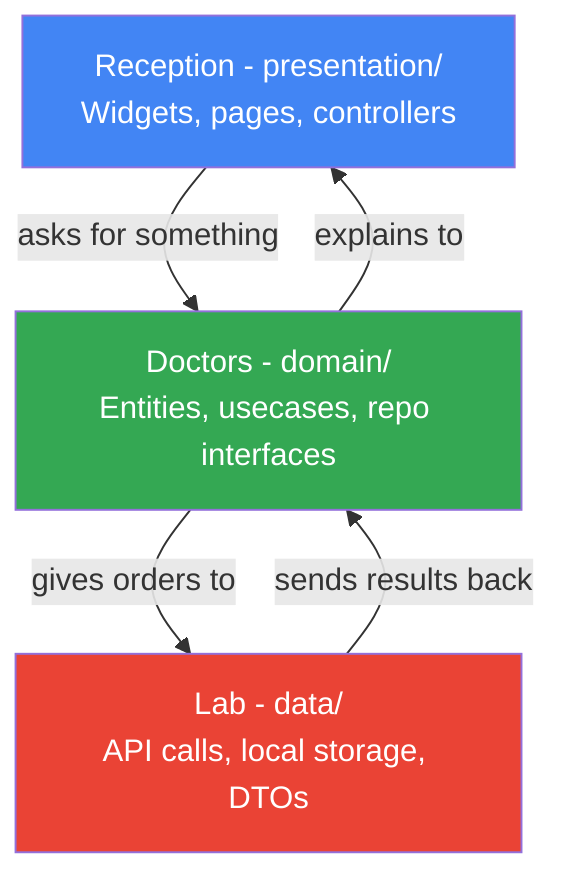

# Architecture Guide — GDG Campus Hub

Read this before touching any code. This is not just a folder map — it's the reasoning behind every decision, written so you build the *instinct*, not just the memorization.

---

## The Big Picture — Read This First

When I started building Flutter apps, I dumped everything into one file. Widget, API call, business logic, all tangled together. It worked, until the app grew past 200 lines and every change felt like defusing a bomb — touch one thing, three other things silently break.

Clean Architecture exists to solve exactly that problem. It separates your code into three layers, each with one job, and a strict rule about what can talk to what. Once this clicks, you will never want to write a Flutter app any other way again.

**Feature-first** means each major area of the app (events, auth, profile) gets its own self-contained mini-version of these three layers. This means two people can work on two different features at the same time without ever touching the same file.

---

## Full Folder Map

```
campus_hub/
  android/                  Auto-generated. Don't touch unless doing native Android work.
  ios/                      Auto-generated. Don't touch unless doing native iOS work.
  web/                      Auto-generated. Flutter web support files.
  test/                     Unit and widget tests go here. Currently empty.
  pubspec.yaml              Project manifest: dependencies, assets, fonts. MAINTAINER ONLY.
  pubspec.lock              Auto-generated lock file. Never edit manually.

  .github/                  GitHub-specific config. MAINTAINER ONLY.
    CODEOWNERS              Defines who must review changes to critical files.
    pull_request_template.md
    ISSUE_TEMPLATE/

  README.md                 Project overview and getting started guide.
  ARCHITECTURE.md           This file.
  CONTRIBUTING.md           How to contribute, branch rules, PR checklist.
  SECURITY.md               Security guidelines for contributors.

  lib/                      All Dart/Flutter source code lives here.
    main.dart               Entry point. Sets up ProviderScope. Nothing else.
    app.dart                MaterialApp.router: wires theme, router, Riverpod.

    core/                   Shared infrastructure. Used by ALL features.
      routing/app_router.dart
      theme/app_theme.dart
      theme/theme_controller.dart
      di/service_locator.dart
      error/failures.dart
      utils/constants.dart

    features/
      events/               PRIMARY feature. Start here as a contributor.
        presentation/pages/events_list_page.dart
        presentation/pages/event_detail_page.dart
        presentation/widgets/event_card.dart
        presentation/controllers/events_controller.dart
        domain/entities/event.dart
        domain/usecases/get_events.dart
        domain/usecases/search_events.dart
        domain/repositories/events_repository.dart
        data/datasources/events_local_datasource.dart
        data/datasources/events_remote_datasource.dart
        data/models/event_model.dart
        data/repositories/events_repository_impl.dart

      auth/                 Stubs only — this is where advanced contributors go deep
        presentation/pages/login_page.dart
        domain/entities/user.dart
        domain/repositories/auth_repository.dart
        data/datasources/auth_local_datasource.dart
        data/repositories/auth_repository_impl.dart

      profile/              Stubs only for now.
        presentation/pages/profile_page.dart
```

---

## Why Three Layers Per Feature — The Intuition

I want you to picture a hospital instead of a folder tree.

```
presentation/  ->  Reception desk. Talks to patients (users). Knows nothing about medicine.
domain/        ->  The doctors. They make decisions and give orders. Don't touch equipment.
data/          ->  The lab and pharmacy. Does the actual physical work. Doesn't talk to patients.
```

Reception never walks into the lab and grabs a sample themselves. They tell a doctor what the patient needs. The doctor decides what test is needed and orders it. The lab does the test and returns results to the doctor, who explains it to reception, who explains it to the patient.

That's the entire architecture. If you remember this metaphor, you will always know where new code belongs.



**The golden rule: arrows only point downward.** `presentation` calls `domain`. `data` implements `domain`. `domain` never imports from `presentation` or `data` — ever. This is the one rule that, if broken, unravels the entire benefit of this architecture.

Why does this matter practically? If you want to swap your mock data for a real API tomorrow, you only touch `data/`. Nobody upstream even notices the change happened.

---

## Data Flow — A Complete Real Example

Here is exactly what happens, step by step, when `EventsListPage` loads and shows events on screen. I want you to trace this with your finger on the actual files while reading it.

```
1. EventsListPage (presentation/pages/)
   watches eventsControllerProvider via ref.watch()

2. EventsNotifier (presentation/controllers/)
   on init, calls the GetEvents use case

3. GetEvents (domain/usecases/)
   calls EventsRepository.getEvents() -- an interface, not a real class

4. EventsRepository (domain/repositories/)
   is abstract -- the notifier does not know or care what implements it

5. EventsRepositoryImpl (data/repositories/)
   implements EventsRepository
   calls EventsLocalDataSource.getEvents()

6. EventsLocalDataSource (data/datasources/)
   returns a List<EventModel> -- raw data with JSON knowledge

7. EventsRepositoryImpl
   returns the list upward as List<Event> -- the pure entity, not the model

8. GetEvents returns List<Event> to EventsNotifier

9. EventsNotifier updates state -> EventsState(events: [...], isLoading: false)

10. EventsListPage rebuilds automatically via ref.watch() and renders EventCards
```

Notice something important: `presentation` never sees `EventModel` or `EventsLocalDataSource`. It only ever knows about `Event` (the clean entity) and `GetEvents` (the use case). The data layer is completely invisible from the UI's perspective. That invisibility is the entire point.

---

## Layer 1 — presentation/

This layer's only job is showing things to the user and reacting to taps. If you find yourself writing an `http.get()` call inside a widget, stop — that code belongs three folders away in `data/`.

```
presentation/
  pages/        Full screens. One file per screen. Maps to a GoRouter route.
  widgets/      Reusable UI pieces smaller than a full screen.
  controllers/  Riverpod Notifiers. Bridge between UI and domain.
```

Rules for `pages/`: a page is mostly layout and composition. It reads state via `ref.watch(...)`. It should never make direct API calls.

Rules for `widgets/`: receive data through constructor parameters only. Never fetch their own data. Keep them small and single-purpose.

Rules for `controllers/`: call use cases from `domain/usecases/`. Expose state (loading, data, error). Never import directly from `data/` — only from `domain/`.

---

## Layer 2 — domain/

This is the heart of the feature — pure Dart, zero Flutter imports, zero HTTP, zero database code. If you can imagine running this code in a command-line Dart script with no Flutter installed, it belongs here.

```
domain/
  entities/      Core data models. Plain Dart classes. No JSON, no annotations.
  usecases/      One class per operation the app can perform. Single call() method.
  repositories/  Abstract interfaces -- WHAT is possible, not HOW it's done.
```

Why keep `domain/` framework-agnostic? Because business rules shouldn't care if you're running on Flutter, a server, or a CLI tool. That purity is what makes this layer trivially testable.

---

## Layer 3 — data/

This is where the app actually touches the outside world.

```
data/
  datasources/   Classes that fetch raw data (HTTP, local DB, mock data).
  models/        DTOs -- entities plus JSON serialization (fromJson/toJson).
  repositories/  Concrete classes implementing the domain interfaces.
```

Why not put `fromJson` directly on the entity? Because the entity belongs to `domain/`, which must stay pure. JSON parsing is a data concern, not a business concern. If the API changes field names tomorrow, you edit the model — the entity and every business rule built on it stay untouched.

---

## Common Mistakes I Want You to Avoid

I am listing these because I have made every single one of them at some point. Learning to spot these early will save you hours of confused debugging.

| Wrong | Right | Why it matters |
|---|---|---|
| `Dio().get(url)` inside a widget | Call Dio inside a class in `data/datasources/` | Widgets should never know HTTP exists |
| `json.decode(response)` inside an entity | Parse JSON inside a `model` class in `data/` | Entities must stay pure Dart, framework-agnostic |
| `EventsRepositoryImpl()` created directly inside a widget | Wire it through a Riverpod provider | Widgets should read state, never construct dependencies |
| `ref.watch(...)` inside an `onPressed` callback | Use `ref.read(...)` inside callbacks | `watch` triggers rebuilds; using it in a callback causes errors |
| Navigating to a route that doesn't exist in `app_router.dart` | Add the route there first | GoRouter is the single source of truth for navigation |
| Business logic living inside a `StatelessWidget` | Move it into a `Notifier` in `controllers/` | UI should display state, never own it |

---

## Folder Ownership — Blast Radius Table

Before you edit a file, ask yourself: "if I get this wrong, how far does the damage spread?" This table is my honest answer to that question, feature by feature.

| File / Folder | Risk Level | Blast Radius If Changed Wrong |
|---|---|---|
| `presentation/widgets/` | Low | Only that one component looks wrong |
| `presentation/pages/` | Low | Only that one screen breaks |
| `presentation/controllers/` | Medium | Everything the page displays goes stale or wrong |
| `domain/usecases/` | Medium | One operation across the whole feature misbehaves |
| `domain/repositories/` (interface) | High | Every implementation of it must update too, or the app won't compile |
| `domain/entities/` | High | Breaks models, use cases, and anything referencing that entity |
| `data/repositories/` | Medium | Only affects where data comes from — domain and UI stay safe |
| `core/routing/app_router.dart` | High | Breaks navigation across the entire app |
| `core/theme/app_theme.dart` | Medium | Changes the visual look of the whole app |
| `core/di/service_locator.dart` | High | If a dependency isn't registered, the app crashes on startup |
| `pubspec.yaml` | High | One typo here and the app won't even build |

---

## Where to Start — By Experience Level

### New to Flutter — stay inside these files first

- `lib/features/events/presentation/pages/events_list_page.dart`
- `lib/features/events/presentation/widgets/event_card.dart`
- Look for issues labeled `good first issue`

### Comfortable with Flutter — go one layer deeper

- `lib/features/events/presentation/controllers/events_controller.dart`
- `lib/features/events/domain/usecases/`
- Look for issues labeled `intermediate`

### Into architecture and patterns — go all the way

- `lib/features/events/data/` — swap mock for a real API
- `lib/features/auth/` — implement the full auth feature end-to-end
- `lib/core/` — improve DI, routing, error handling
- Look for issues labeled `advanced`

---

## Rules Summary

| Rule | Why it exists |
|---|---|
| `domain/` has zero Flutter imports | Keeps business logic framework-agnostic and testable |
| `presentation/` never imports from `data/` | Enforces one-way dependency flow |
| One page = one file in `pages/` | Easy to find, easy to navigate |
| Widgets receive data via constructor, never fetch it themselves | Keeps widgets reusable and stateless |
| Controllers only call use cases, never data sources directly | Maintains layer separation |
| `core/` is maintainer-only | Prevents breaking changes across all features |
| Entity is never the same as Model (no JSON in entities) | Separates business concepts from transport concerns |
